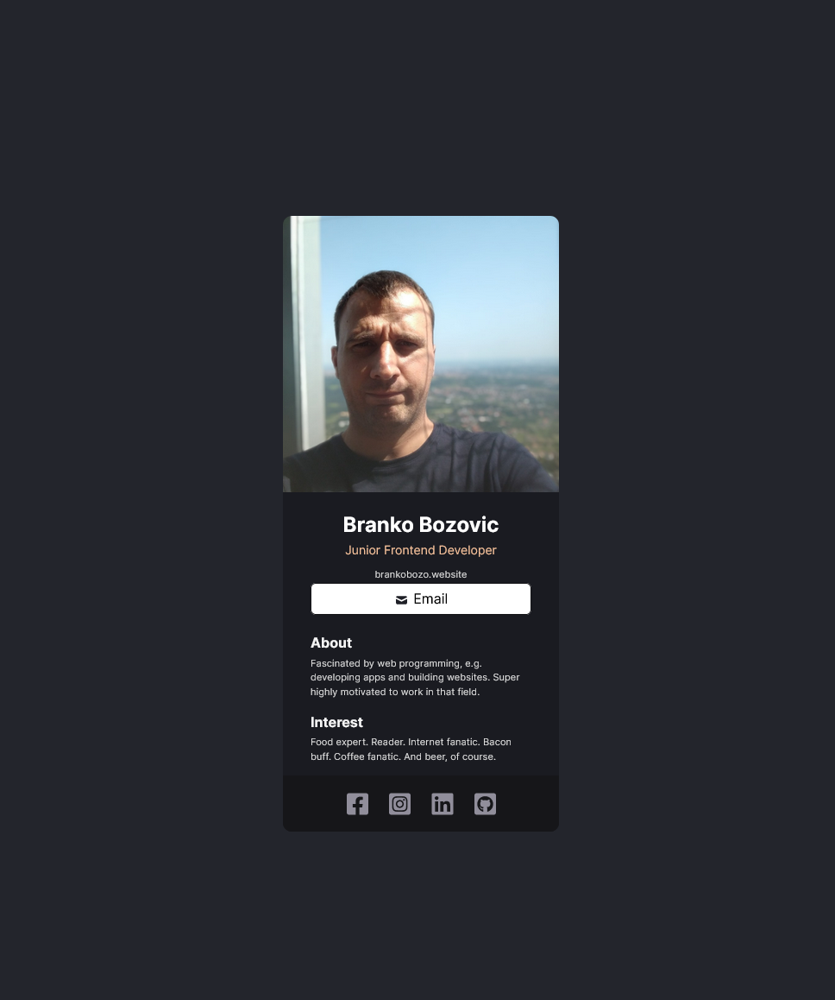

# Getting Started with React - Digital Business Card

Solution to the Digital Business Card solo project on Scrimba

## The challenge

- Build from scratch!
- Fill in your own information
- Separate components for:
  - Info (photo, name, buttons, etc.)
  - About
  - Interests
  - Footer (social icons)

## Links

- [Code](https://github.com/brankobozo/digital-business-card)
- [live](https://digi-bus-card.netlify.app/)

## Tools

- Semantic HTML5 markup
- ReactJS
- CSS flexbox, css custom properties

## Screenshots

## Available Scripts

In the project directory, you can run:

### `npm start`

Runs the app in the development mode.\
Open [http://localhost:3000](http://localhost:3000) to view it in your browser.

The page will reload when you make changes.\
You may also see any lint errors in the console.

### `npm run build`

Builds the app for production to the `build` folder.\
It correctly bundles React in production mode and optimizes the build for the best performance.

The build is minified and the filenames include the hashes.\
Your app is ready to be deployed!

See the section about [deployment](https://facebook.github.io/create-react-app/docs/deployment) for more information.
